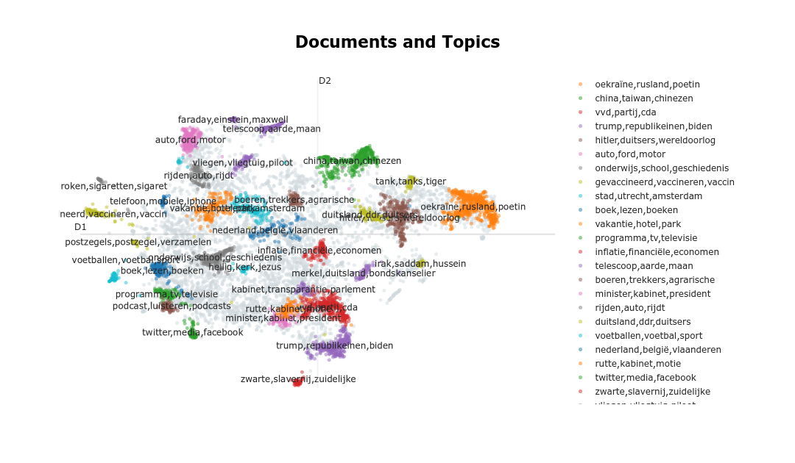
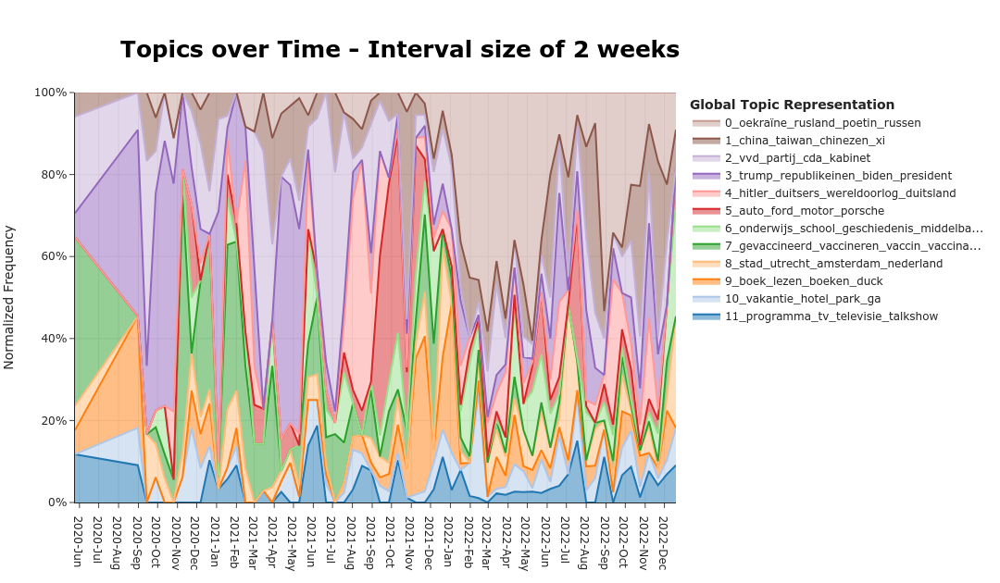

# Maarten_De_Podcast_Analysis - Text analysis using `Whisper` amd `BERTopic`
This project explores how to use open-source tools such as `Whisper` and `BERTopic` to perform NLP on spoken content such as podcasts and videos.

# Abstract
De 'Maarten van Rossem'-podcast is one of the most popular podcasts in The Netherlands, which has produced more than 300 episodes in the past 2 years. In this article, we produce some fun, and hopefully interesting, statistics about the podcast. This is done by collecting all the currently available podcast episodes from the web, and transcribing them using the newly available `Whisper` automated speech recognition model by [OpenAI](https://github.com/openai/whisper). After some initial statistical analysis of the podcast, we finish our analysis by extracting topics from podcast using `BERTopic`, a Topic Modeling pipeline by [Maarten Grootendorst](https://github.com/MaartenGr/BERTopic). The goal of this project is first of all to have fun analysing the words of Maarten and Tom. I hope you'll learn something interesting from all this, enjoy!

To read the blogpost, [please click here](https://avvorstenbosch.github.io/Maarten_De_Podcast_Analysis/Maarten.html)

# Usage
This reposirtory consists of 3 primary components:

* A Webscraper to extract our audio-content, found under `./extract_data`
* A shell script to run `Whisper` to transcribe this content, found under `./speech_to_text`
* An analysis of the transcribed content, starting from simple techniques such as count-vectorizers up to more advanced models such as `BERTopic`.

Aditionally, `./extract_data` and `./speech_to_text` contain scripts which help with updating our dataset. This is usefull when your busy processing a podcast which has a weekly release cycle. 